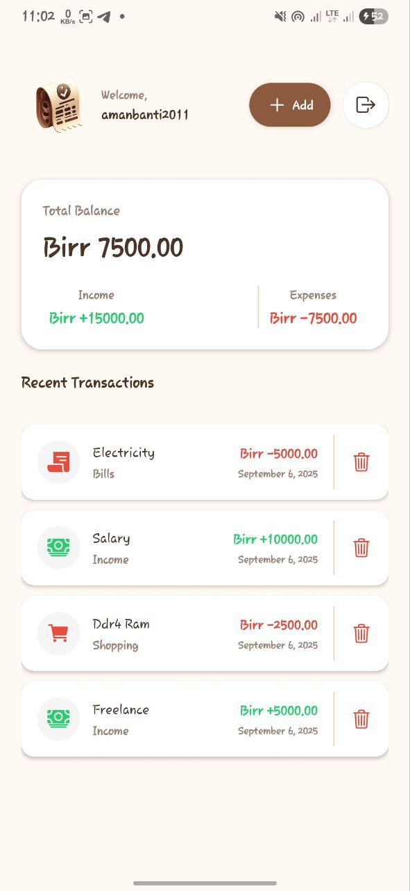
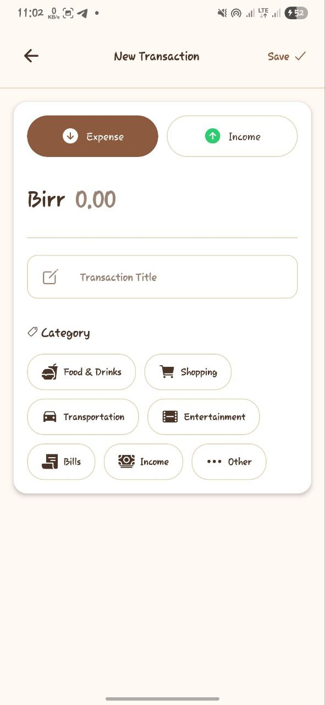

# 💳 et-wallet

A cross-platform digital wallet application with a **Node.js backend** and a **React Native mobile app**.  
This project is designed to provide a simple and secure way to manage digital transactions.

---

## 🚀 Features

- 🔐 Secure user authentication  
- 💸 Manage and track transactions  
- 📱 Mobile-first design with React Native  
- 🌐 RESTful API built with Node.js & Express  
- 📊 Clean and intuitive user interface  

---

## 🖼️ Screenshots

> Add screenshots or demo GIFs here  

  
  

---

## 📂 Project Structure

```bash
et-wallet/
├── backend/       # Node.js + Express API
├── mobile/        # React Native application
├── package.json
└── README.md
